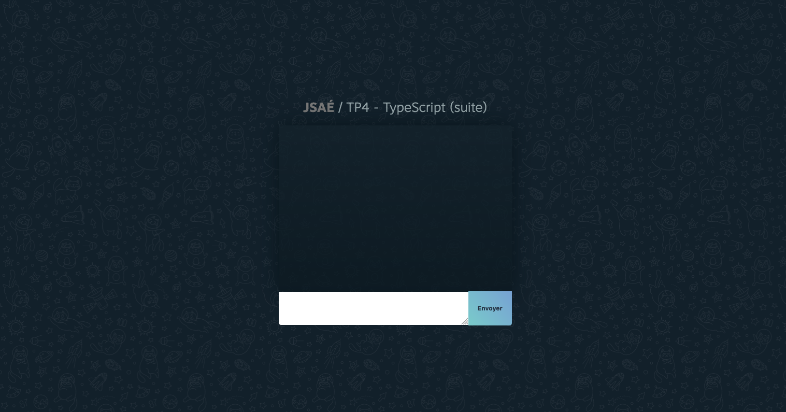

## Sommaire <!-- omit in toc -->

- [A. Préparatifs](#a-préparatifs)
- [B. Finalisation TS serveur](#b-finalisation-ts-serveur)
- [C. Debug TS](#c-debug-ts)
- [D. TypeScript client](#d-typescript-client)

## A. Préparatifs

**Dans le prolongement du précédent TP, le code fourni ici contient à la fois du code JS & TS backend (Node.js + Socket.io) et frontend. Il va servir de base à la suite de ce TP.**

1. **Faites un fork de ce TP ou un clone avec changement de remote** et ajoutez votre encadrant.e de TP en "reporter" (`@patricia.everaere-caillier` ou `@thomas.fritsch`)
2. **Ouvrez le dossier du TP dans vscode**
3. **Installez les dépendances du projet** avec `npm i`
4. **lancez la compilation du code TS du serveur** en lançant la commande :
	```bash
	npm run watch:server
	```
6. **Dans un second terminal splitté, lancez le serveur node et la compilation du JS front (webpack-dev-middleware)** :
	```bash
	npm run dev
	```

	Vous devriez avoir dans le navigateur une popup vous demandant d'entrer votre nom puis la page suivante :

	

	Pour vérifier que tout fonctionne, ouvrez une autre fenêtre de votre navigateur (_de préférence en navigation privée pour qu'il vous demande un nouveau nom_) puis envoyez un message dans une des 2 fenêtres et vérifiez qu'il s'affiche bien dans des 2 côtés.

## B. Finalisation TS serveur


**Lors du précédent TP vous avez créé un certain nombre de classes et de types codée en TypeScript mais le code principal de l'application, le fichier `server/src/index.js`, dans lequel se trouve le code du serveur socket.io, est resté en JS.**

Dans cette partie du TP nous allons donc convertir ce fichier en TS et voir notamment comment typer une application Socket.io.

1. **Pour commencer, ajoutez la configuration suivante dans votre fichier `/.vscode/settings.json` pour permettre de reformater avec prettier votre code TS :**

	```json
	"[typescript]": {
		"editor.formatOnSave": true,
		"editor.defaultFormatter": "esbenp.prettier-vscode",
	}
	```
2. **Stoppez ensuite la commande `npm run dev`** et **changez l'extension** du fichier `server/src/index.js` en `.ts`
3. Comme la compilation de notre code TS continue en watch (`npm run watch:server`) il suffit de **relancer le serveur avec `npm run dev`**
4. En principe votre code doit compiler sans erreurs grâce à l'[inférence de types _(doc)_](https://www.typescriptlang.org/docs/handbook/type-inference.html#handbook-content) : TypeScript "devine" les types des différentes variables et constantes.

	On peut cependant améliorer un peu le typage de notre application notamment en typant notre serveur Socket.io : en suivant le guide disponible dans la section `"Types for the server"` disponible dans la [documentation de Socket.io : https://socket.io/docs/v4/typescript/](https://socket.io/docs/v4/typescript/) typez votre serveur Socket.io.

	Grâce au typage, si vous tapez `socket.on(` dans votre code, vscode vous suggérera les différents types d'événements possibles !

	> _**NB :** dans ce TP, nous n'avons qu'un seul serveur websocket, et nous ne stockons rien dans `socket.data`, tirez en les conclusions qui s'imposent quand aux interfaces `InterServerEvents` et `SocketData`_


## C. Debug TS
**Actuellement on a appris à compiler et à lancer notre serveur en 2 étapes : `npm run build:server` (ou `watch:server`) pour compiler notre code TS+JS d'un côté, et `npm run dev` pour lancer le code compilé.**

Le problème de cette technique c'est qu'en plus d'être pénible (_devoir lancer 2 commandes c'est fatiguant_) on a perdu la possibilité de débugger notre code via vscode.

Voyons donc comment réparer ça :

1. Stoppez les deux commandes `npm run watch:server` et `npm run dev`
2. Installez [nodemon _(npm)_](https://www.npmjs.com/package/nodemon) et [ts-node _(npm)_](https://www.npmjs.com/package/ts-node) :
	```bash
	npm i -D nodemon ts-node
	```
3. Dans le fichier `/.vscode/launch.json`, modifiez la configuration "Debug server" :

	```diff
	{
		"name": "Debug server",
		"type": "node",
		"request": "launch",
		"cwd": "${workspaceFolder}",
	-	"runtimeExecutable": "npm",
	-	"runtimeArgs": ["run-script", "dev"],
	+	"program": "./server/src/index.ts",
	+	"runtimeExecutable": "${workspaceFolder}/node_modules/.bin/nodemon",
	+	"args": ["--ignore","./client"],
	+	"restart": true,
		"skipFiles": ["<node_internals>/**"],
		"env": {
			"PORT": "8000"
		}
	},
	```
3. Lancez maintenant le debug via <kbd>CTRL</kbd>+<kbd>SHIFT</kbd>+<kbd>P</kbd> : `Debug : Select And Start Debugging` (_ou F5 si la dernière session de debug que vous avez lancée était `Debug server`_).

	Des erreurs s'affichent en principe dans la "Debug Console" ou directement dans votre code si vous aviez coché la case "BREAKPOINTS" > "Uncaught Exceptions" dans le panneau de debug :

	```
	Error: Cannot find module './domain/Author.js'
	Require stack:
	- /Users/thomas/workspace/_formations/cours-javascript/tps-sae/tp4-typescript-etc/server/src/index.ts
		at Function.Module._resolveFilename (node:internal/modules/cjs/loader:1060:15)
		at Function.Module._resolveFilename.sharedData.moduleResolveFilenameHook.installedValue [as _resolveFilename] (/Users/thomas/workspace/_formations/cours-javascript/tps-sae/tp4-typescript-etc/node_modules/@cspotcode/source-map-support/source-map-support.js:811:30)
		at Function.Module._load (node:internal/modules/cjs/loader:905:27)
		...
	```
	En effet, jusque là notre code était exécuté après compilation de TS à JS, les import en ".js" étaient donc corrects puisque tous nos fichiers étaient convertis en .js dans le dossier `server/build`.

	Maintenant que nous utilisons `nodemon` et `ts-node`, le code TS est directement interprété à la volée et plus compilé dans le dossier build. Ce qui explique qu'il ne trouve pas de fichier `"Author.js"`.

	La solution à ce problème est "simple" supprimez simplement l'extension de vos imports : Au lieu d'écrire
	```ts
	import Author from './domain/Author.js';
	```
	écrivez :
	```ts
	import Author from './domain/Author';
	```

	> _**NB :** Pour éviter que par la suite, vscode ne vous ajoute automatiquement des ".js" à chacun de vos import, ajoutez la clé suivante dans votre fichier `/.vscode/settings.json` :_
	> ```diff
	> {
	> 	"[javascript]": {
	> 		"editor.formatOnSave": true,
	> 		"editor.defaultFormatter": "esbenp.prettier-vscode",
	> 		"javascript.preferences.importModuleSpecifierEnding": "js"
	> 	},
	> 	"[typescript]": {
	> 		"editor.formatOnSave": true,
	> 		"editor.defaultFormatter": "esbenp.prettier-vscode",
	> +		"javascript.preferences.importModuleSpecifierEnding": "minimal",
	> 	}
	> }
	> ```

	Une fois tous les import corrigés, mettez un point d'arrêt sur la ligne suivante :
	```ts
	messageRepository.addAuthor(new Author(socket.id, name));
	```
	puis rechargez la page dans votre navigateur pour générer une reconnexion d'un client, le point d'arrêt doit s'activer et vous pouvez voir le contenu des différentes variables locales, notamment `socket`, `name`, etc.


## D. TypeScript client
**Maintenant que notre setup pour TypeScript est opérationnel côté serveur, attaquons nous à la conversion à TS de notre code client.**

Comme on va maintenant avoir 2 codes différents à compiler, il va falloir 2 fichiers `tsconfig.json` (vous vous souvenez, ce fichier sert à indiquer à typescript quels dossiers source compiler dans quel dossier de destination).

Actuellement notre fichier `tsconfig.json` contient le json suivant :
```json
{
	"compilerOptions": {
		"rootDirs": ["server/src", "."],
		"outDir": "server/build",
		"target": "ES6",
		"module": "CommonJS",
		"noEmitOnError": true,
		"sourceMap": true,
		"moduleResolution": "node",
		"esModuleInterop": true,
		"allowJs": true,
		"strict": true,
	},
	"exclude": ["./node_modules", "./client", "./server/build", "build"]
}
```
On voit bien aux clés rootDirs, outDir, et exclude, que cette configuration ne peut pas être utilisée pour notre code client (front).

1. Commencez par ajouter un fichier `tsconfig.client.json` avec le code suivant :

	```json
	{
		"extends": "./tsconfig.json",
		"compilerOptions": {
			"rootDir": "client/src",
			"outDir": "client/public/build/",
			"target": "ES5",
			"module": "ES2022",
			"sourceMap": false,
			"noEmitOnError": false,
		},
		"exclude": ["./node_modules", "./server", "./client/public/build", "webpack.config.js", "jest.config.cjs"],
	}
	```
	> _**NB :** grâce à la clé `"extends"` on peut étendre la config de base et ne réécrire que les valeurs qui nous intéressent._

3. Pour compiler notre code client de TS à JS, on a plusieurs options :

	on peut continuer à utiliser Babel via webpack puisque Babel est capable d'interpréter le TS, mais on va plutôt ici utiliser tsc directement via [ts-loader _(npm)_](https://www.npmjs.com/package/ts-loader)

	Installez donc ts-loader :
	```bash
	npm i -D ts-loader
	```

4. Pour configurer webpack avec `ts-loader` à la place de `Babel`, remplacez la rule de babel comme ceci :

	```diff
	module: {
		rules: [
			{
	-			test: /\.js$/, // tous les fichiers js ...
	+			test: /\.(ts|js)$/, // tous les fichiers js ou ts ...
				exclude: /node_modules/, // ... sauf le dossier node_modules ...
				use: {
	-				// ... seront compilés par babel !
	-				loader: 'babel-loader',
	+				// ... seront compilés par tsc !
	+				loader: 'ts-loader',
	+ 				options: {
	+ 					configFile: 'tsconfig.client.json',
	+ 				},
				},
	- 			type: 'javascript/esm', // permet l'utilisation des modules ES6
			},
		],
	},
	```
5. Changez l'extension du fichier `client/src/main.js` en `.ts` et modifiez la clé "entry" du fichier `webpack.config.js` en conséquence

	```json
	entry: './client/src/main.ts',
	```

	A ce stade, si vous relancez le serveur, vous devriez avoir une dizaine d'erreurs qui s'affichent dans la debug console et directement dans votre fichier `main.ts` dans vscode.

	À vous de les corriger jusqu'à ce que le code compile correctement !

	> _**Indice :** pour typer le résultat de querySelector et se débarrasser des erreurs du type `"'messagesContainer' is possibly 'null'."` vous pouvez utiliser la syntaxe des ["Generics" (doc)](https://www.typescriptlang.org/docs/handbook/2/generics.html) comme ceci :_
	> ```ts
	> document.querySelector('.mySelector') as HTMLDivElement;
	> ```
	> Vous pouvez ainsi utiliser tous les types de balises `HTML****Element` (`HTMLCanvasElement`, `HTMLDivElement`, `HTMLInputElement`, etc. : cf. https://developer.mozilla.org/fr/docs/Web/API#h_2 )

	> _**Indice 2 :** Pour typer la partie socket, vous pouvez suivre les indications de la documentation de socket.io ici : https://socket.io/docs/v4/typescript/#types-for-the-client_
	>
	> _Puisque vous aurez probablement des types à utiliser à la fois côté serveur et client, je vous recommande d'ailleurs de créer un dossier `/common` à la racine du TP et de le rajouter dans les dossiers à compiler dans vos fichiers tsconfig_

