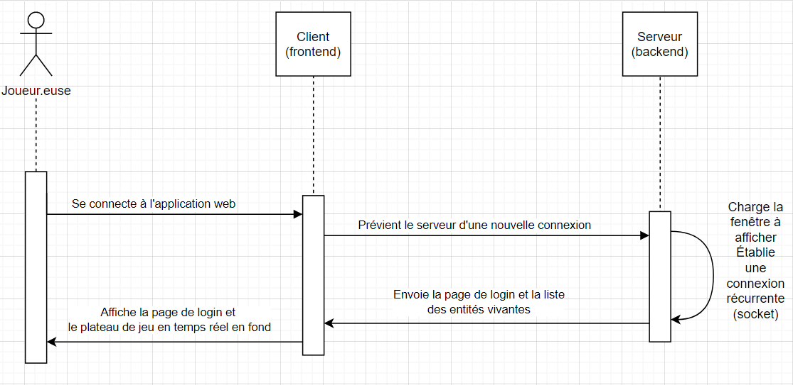
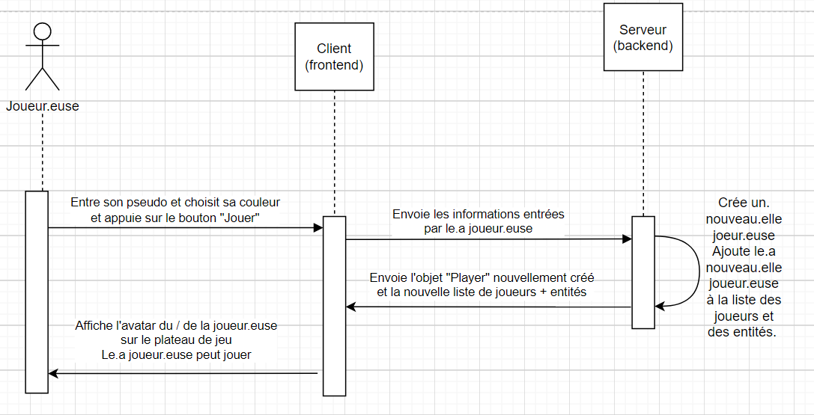
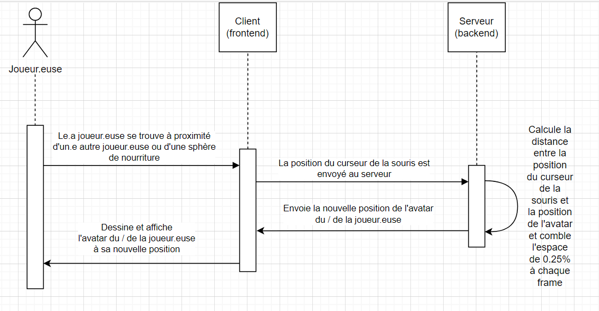
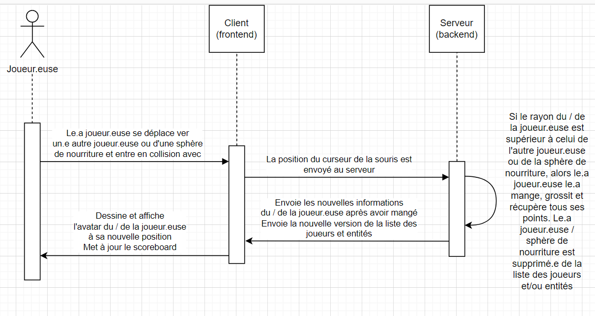
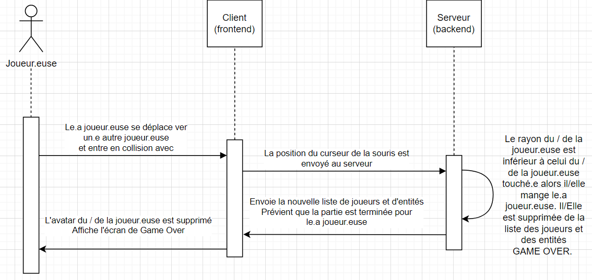
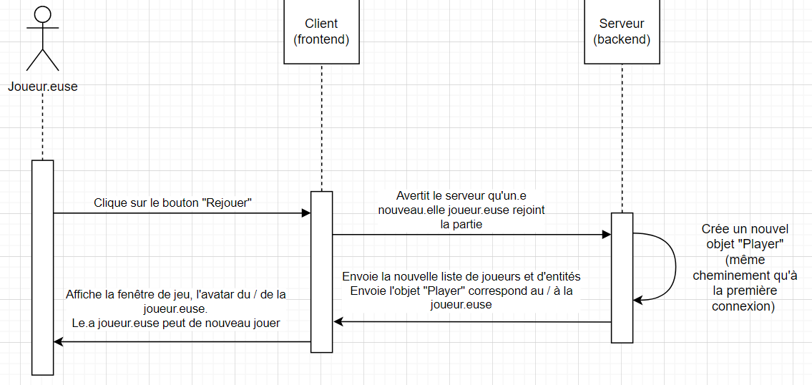
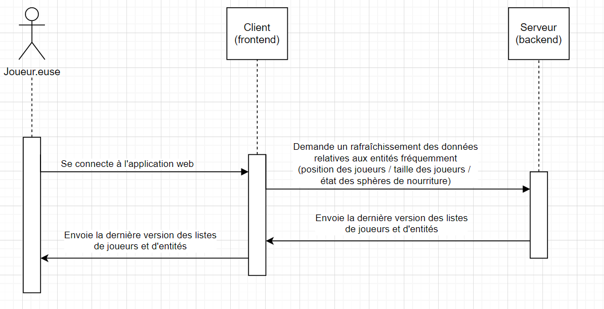
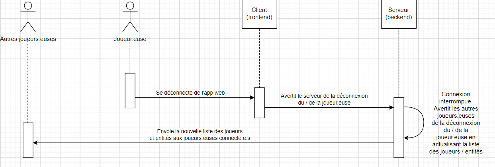
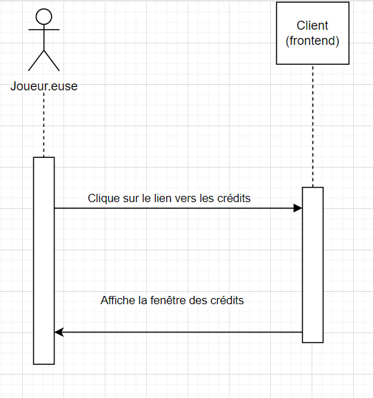

# **SAÉ S4.A.01.2 - Développement d'application.**

## Sommaire <!-- omit in toc -->

- [**SAÉ S4.A.01.2 - Développement d'application.**](#saé-s4a012---développement-dapplication)
	- [A. Introduction.](#a-introduction)
	- [B. Diagramme de séquence.](#b-diagramme-de-séquence)
	- [C. Difficultés rencontrées et fièrté(s).](#c-difficultés-rencontrées-et-fièrtés)
	- [D. Points d'amélioration.](#d-points-damélioration)

## A. Introduction.

Dans le cadre de la formation du Bachelor Universitaire de Technologie Informatique, parcours réalasition d'applications. Nous avons eu à reproduire, en binôme, le fameux jeu vidéo sur navigateur web [Agar.io](https://fr.wikipedia.org/wiki/Agar.io).  

Ce projet fut donc, à l'instar du jeu original, développé sous forme d'application web utilisant donc les technologies de développement web classiques à savoir : 
- JavaScript (frontend)
- TypeScript (fronted / backend)
- HTML / CSS (frontend)
- Socket.io (backend)
- Node.js (backend)

## B. Diagramme de séquence.

- #### Connexion à l'application web.

- #### Cliquer sur le bouton "Jouer".
  

- #### Déplacement en fonction de la position du curseur de la souris.

- #### Collision avec un.e autre joueur.euse / une sphère de nourriture.

- #### Le.a joueur.euse se fait manger par un.e autre joueur.euse.

- #### Rejouer

- #### Rafraîchissement de l'affichage et des données.

- #### Le.a joueur.euse se déconnecte de l'application.

- #### Cliquer sur le lien "Crédits" du menu principal.

## C. Difficultés rencontrées et fièrté(s).

Les difficultés rencontrées se sont fait ressentir en grande partie au début du projet. 
Le projet a mis un petit peu de temps à commencer, le temps de trouver la manière dont nous allions procéder pour implémenter les différentes fonctionnalités de l'application. Notamment en ce qui concernait les déplacements de l'avatar des joueurs.euses.

De nombreuses heures ont également été utilisées afin d'essayer de configurer correctement divers éléments nécessaires à la réalisation du développement du jeu. L'architecture du projet aura été revue à plusieurs reprises jusqu'à ce que tout fonctionne comme attendu.  

Bien évidemment, le développement a également été perturbé par moment vis à vis de la situation politique du pays et des nombreuses grèves interprofessionnelle au cours des trois derniers mois.

Beaucoup de bugs furent découvert à la toute fin du projet, freinant grandement l'implémentation des dernières fonctionnalités notamment vis à vis de l'interface utilisateur. Bien que certains furent corrigés, d'autres subsistent encore ou n'ont pas été encore relevés.

Nous sommes  malgré tout parvenu à surmonter ces difficultés avec ou sans l'aide d'acteurs tierces (étudiant.e.s / enseignant.e.s / internet / ...). C'est un point que nous aimerions souligner tout de même car à chaque résolution de bug, à chaque retour à la normale d'une fonctionnalité ou d'une configuration, un sentiment de soulagement se faisait ressentir ainsi qu'un sentiment de victoire, aussi simple et "futile" puisse-t-elle être. Ces petites victoires menaient à de plus grande et apportait avec elles leurs petites doses de motivation nécessaires au bon développement de l'application.  
Nous sommes également fier d'avoir négocier plutôt correctement le passage à TypeScript, bien qu'il ne s'agisse que d'une "simple surcouche" à JavaScript, nous n'avons pas mis beaucoup de temps avant de trouver les bons types à utiliser vis à vis des objets relatifs au serveur (Socket.io). Cela s'explique notamment grâce aux TPs réalisés en parallèle du développement du jeu.

## D. Points d'amélioration.

Notre projet est malheureusement loin d'être parfait. Que cela soit dans son optimisation, dans la propreté du code ou dans
le choix d'implémentation des différentes fonctionnalités qui pourraient, pour une partie de ces points soulevés, être revus.

Nous sommes tout de même parvenus à mettre en place les fonctionnalités principales du jeu Agar.io, à savoir : 
- Se déplacer en fonction de la position de la souris.
- Manger un.e joueur.euse ou une sphère de nourriture plus petite que le.a joueur.euse courant.e.
- Se faire manger par un.e joueur.euse dont le rayon de son avatar est supérieur à celui du / de la joueur.euse courant.e
- Grossir après avoir manger un.e joueur.euse / sphère de nourriture.  

Parmi les fonctionnalités à revoir, nous pouvons noter la possibilité d'ajuster l'échelle d'affichage du plateau de jeu en fonction
du rayon du joueur qui à cesser de fonctionné correctement lors de la séparation du code entre la partie "Client" et "Serveur".
Nous pouvons aussi noter une mauvaise gestion des éléments du côté "Client" vis à vis de l'interface graphique dont le code n'est
pas optimal et loin d'être ergonomique. En éparpillant par exemple les différentes "Views" en classes à part entière (GameView / CreditsView / LoginView / GameOverView).

Afin de prévoir de potentielles difficultés étant survenues par le passé, ou pouvant survenir à l'avenir. Il serait préférable
de mettre en place une véritable forme de gestion de projet par l'intermédiaire d'outils tels que "Trello", "Kanban" ou "Padlet" afin de visualiser le travail à réaliser mais également l'avancée concrète du projet afin d'avoir une meilleure vision dans le temps et de se projetter vis à vis de l'état actuel du projet. A ce même titre nous pouvons penser aux "Issues" GitLab pouvant également remplir ce rôle en partie. Une meilleure communication et répartition des tâches se devront également d'être faits plus clairement afin que le rôle de chacun soit fixe afin de ne pas réaliser un travail qui aurait déjà été réalisé.  
Nous avons reçu des consignes et/ou des conseils sur ce sujet, nous nous en sommes trop peu inspirés, à nous maintenant de faire face aux conséquences.

_-- Crédits --   
(Template Markdown reprise des README.md fourni dans les sujets de TP JSAÉ réalisés par M. Thomas FRITSCH)_
